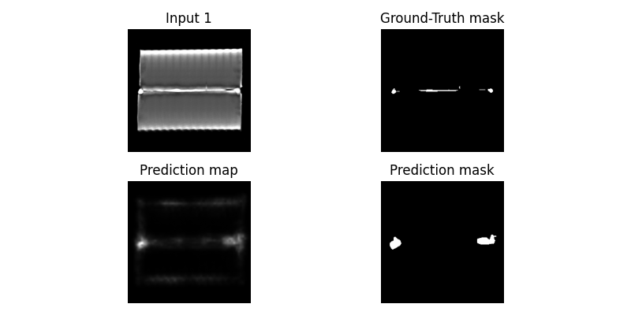
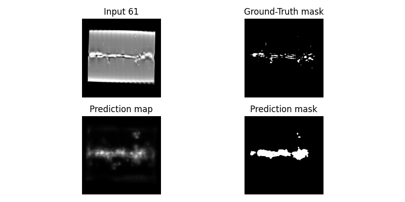

# Detection Models
> This directory contains implementations of detection models used for anomaly detection.

Detection models typically utilize **unsupervised** or **semi-supervised** training, therefore they expect dataset with mostly normal samples. Since the provided dataset lacks normal samples completely, a non-standard **patch-based** approach was employed. These models were trained with 128x128 **normal patches** with the cost of losing global context but enabling experimentation with this type of models.

The experimentation included many models, of which only one produced relevant outcomes. There are several factors that could affect this low success rate, such as the non-standard training methodology, selected image size, and others.

### Implemented Models
> Models are implemented using [Anomalib](https://github.com/open-edge-platform/anomalib) library.
<table>
    <tr>
        <th>STFPM</th>
        <td>Student-Teacher Feature Pyramid Matching</td>
        <td>2021</td>
        <td><a href="https://arxiv.org/abs/2103.04257">paper</a></td>
        <td><a href="https://anomalib.readthedocs.io/en/latest/markdown/guides/reference/models/image/stfpm.html">model</a></td>
    </tr>
</table>

### Structure
* [**`fit.py`**](fit.py) - Entry point for creating / training and testing model
* [**`inference.py`**](inference.py) - Entry point for model inference
* [**`utils.py`**](utils.py) - Helper functions

**`models`**
* [**`base.py`**](models/base.py) - Abstract `BaseModel` class for other models with shared methods
* [**`stfpm.py`**](models/stfpm.py) - `STFPM` model implementation

### Outcomes

<table>
    <tr>
        <td colspan="4" align="center"><strong>STFPM</strong> (Resnet-18 backbone)</td>
    </tr>
    <tr>
        <td colspan="4"></td>
    </tr>
    <tr>
        <th>Pixel AUROC</th>
        <th>Pixel AP</th>
        <th>IoU</th>
        <th>F1</th>
    </tr>
    <tr>
        <td align="center">0.944</td>
        <td align="center">0.215</td>
        <td align="center">0.141</td>
        <td align="center">0.247</td>
    </tr>
    <tr>
        <td colspan="4"></td>
    </tr>
    <tr>
        <th>Pixel AUROC</th>
        <th>Pixel AP</th>
        <th>IoU</th>
        <th>F1</th>
    </tr>
    <tr>
        <td align="center">0.959</td>
        <td align="center">0.187</td>
        <td align="center">0.182</td>
        <td align="center">0.307</td>
    </tr>
</table>