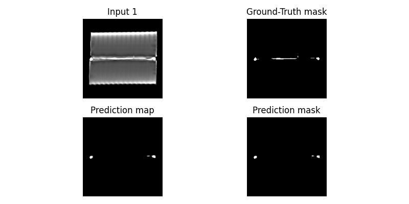

# Segmentation models
> This directory contains the implementations of segmentation models used for anomaly detection.

Segmentation models are trained in a **supervised** way with existing ground-truth masks. To address the extremely small size of the dataset, **cross-validation** and **augmentation** techniques used during training.

### Implemented Models
> Models are implemented using [SMP (Segmentation Models Pytorch)](https://github.com/qubvel-org/segmentation_models.pytorch) library.
<table>
    <tr>
        <th>Unet++</th>
        <td>nested U-Net</td>
        <td>2018</td>
        <td><a href="https://arxiv.org/abs/1807.10165v1">paper</a></td>
        <td><a href="https://smp.readthedocs.io/en/latest/models.html#unetplusplus">model</a></td>
    </tr>
    <tr>
        <th>SegFormer</th>
        <td>semantic Segmentation with transFormers</td>
        <td>2021</td>
        <td><a href="https://arxiv.org/abs/2105.15203">paper</a></td>
        <td><a href="https://smp.readthedocs.io/en/latest/models.html#segformer">model</a></td>
    </tr>
    <tr>
        <th>DPT</th>
        <td>Dense Prediction Transformer</td>
        <td>2021</td>
        <td><a href="https://arxiv.org/abs/2103.13413">paper</a></td>
        <td><a href="https://smp.readthedocs.io/en/latest/models.html#dpt">model</a></td>
    </tr>
</table>

### Structure
* [**`fit.py`**](fit.py) - Entry point for creating / training and testing model
* [**`inference.py`**](inference.py) - Entry point for model inference
* [**`base.py`**](base.py) - Abstract `BaseModel` class for other models with shared methods
* [**`models.py`**](models.py) - Specific model implementations (Extends `BaseModel`)
* [**`utils.py`**](utils.py) - Helper functions

### Outcomes

<table>
    <tr>
        <td colspan="4" align="center"><strong>UNet++</strong> (Resnet-18 backbone)</td>
    </tr>
    <tr>
        <td colspan="4"></td>
    </tr>
    <tr>
        <th>Pixel AUROC</th>
        <th>Pixel AP</th>
        <th>IoU</th>
        <th>F1</th>
    </tr>
    <tr>
        <td align="center">0.817</td>
        <td align="center">0.731</td>
        <td align="center">0.676</td>
        <td align="center">0.755</td>
    </tr>
    <tr>
        <td colspan="4"></td>
    </tr>
    <tr>
        <th>Pixel AUROC</th>
        <th>Pixel AP</th>
        <th>IoU</th>
        <th>F1</th>
    </tr>
    <tr>
        <td align="center">0.841</td>
        <td align="center">0.737</td>
        <td align="center">0.673</td>
        <td align="center">0.783</td>
    </tr>
    <tr>
        <td colspan="4" align="center"><strong>SegFormer</strong> (MiT-b0 backbone)</td>
    </tr>
    <tr>
        <td colspan="4"></td>
    </tr>
    <tr>
        <th>Pixel AUROC</th>
        <th>Pixel AP</th>
        <th>IoU</th>
        <th>F1</th>
    </tr>
    <tr>
        <td align="center">0.795</td>
        <td align="center">0.494</td>
        <td align="center">0.368</td>
        <td align="center">0.527</td>
    </tr>
    <tr>
        <td colspan="4"></td>
    </tr>
    <tr>
        <th>Pixel AUROC</th>
        <th>Pixel AP</th>
        <th>IoU</th>
        <th>F1</th>
    </tr>
    <tr>
        <td align="center">0.899</td>
        <td align="center">0.572</td>
        <td align="center">0.405</td>
        <td align="center">0.568</td>
    </tr>
    <tr>
        <td colspan="4" align="center"><strong>DPT</strong> (ViT-base-16-224 backbone)</td>
    </tr>
    <tr>
        <td colspan="4"></td>
    </tr>
    <tr>
        <th>Pixel AUROC</th>
        <th>Pixel AP</th>
        <th>IoU</th>
        <th>F1</th>
    </tr>
    <tr>
        <td align="center">0.699</td>
        <td align="center">0.616</td>
        <td align="center">0.494</td>
        <td align="center">0.604</td>
    </tr>
    <tr>
        <td colspan="4"></td>
    </tr>
    <tr>
        <th>Pixel AUROC</th>
        <th>Pixel AP</th>
        <th>IoU</th>
        <th>F1</th>
    </tr>
    <tr>
        <td align="center">0.691</td>
        <td align="center">0.467</td>
        <td align="center">0.411</td>
        <td align="center">0.576</td>
    </tr>
</table>
